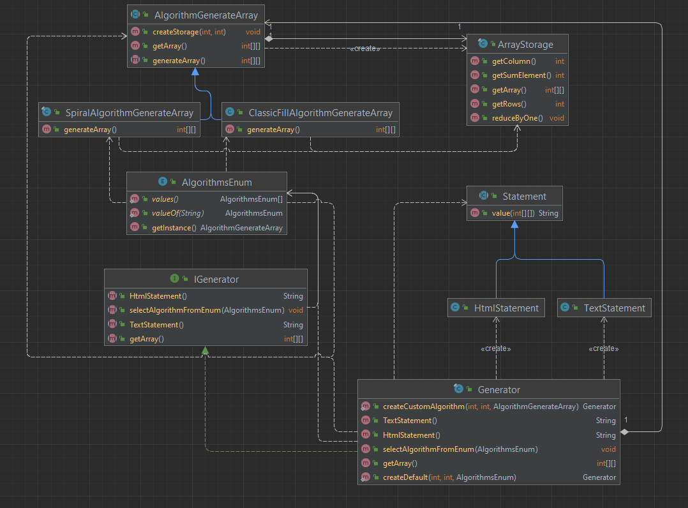

Задача: Закрутить 2d массив в спираль


Клиентский код:

```
Generator generator =Generator.createDefault(5, 5, AlgorithmsList.SPIRAL);
System.out.println(generator.TextStatement());
System.out.println("=".repeat(20));
generator.selectAlgorithmFromEnum(AlgorithmsList.CLASSIC_FILL);
System.out.println(generator.TextStatement());
```

Способ решения:  
Чередование четырех функций: вправо - вниз - назад - вверх

Работает с любым 2d массивом. Будь то квадрат или прямоугольник.

**Особенности:**
- Применен паттерн "команда"  
Инициатор: Generator  
Получатели: все наследники базового алгоритмического класса

Тесты:  


При желании можно запустить подготовленный jar файл.

