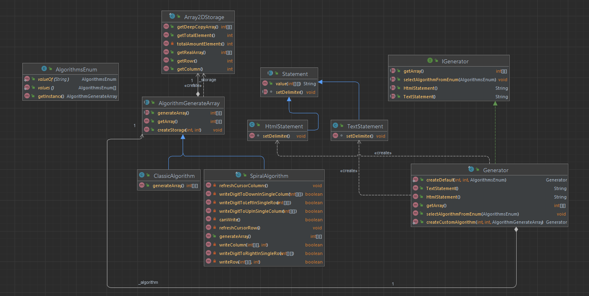
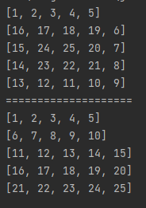
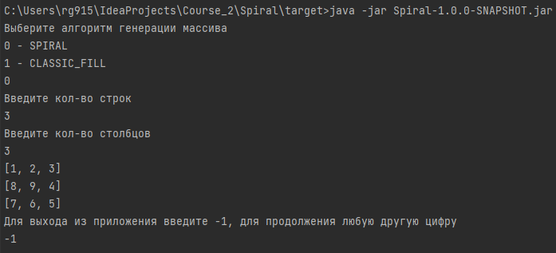

**Задача: Закрутить 2d массив в спираль**  

Алгоритм Spiral
Пример:  
1 2 3  
8 9 4  
7 6 5  
Для усложнения задачи решил разработать архитектуру для модуля, который бы мог работать с множеством алгоритмов по 
генерации массивов. Для наглядности добавил алгоритм Classic:  
1 2 3  
4 5 6  
7 8 9  



Клиентский код:

```java
Generator generator =Generator.createDefault(5, 5, AlgorithmsList.SPIRAL);
System.out.println(generator.TextStatement());
System.out.println("=".repeat(20));
generator.selectAlgorithmFromEnum(AlgorithmsList.CLASSIC_FILL);
System.out.println(generator.TextStatement());
```

Способ решения:  
Чередование четырех функций: вправо - вниз - назад - вверх

Работает с любым 2d массивом. Будь то квадрат или прямоугольник.

**Особенности:**
- Применен паттерн "команда"  
Инициатор: **Generator**  
Получатели: все наследники базового алгоритмического класса **AlgorithmGenerateArray**
- Регистрация нового алгоритма происходит в "АlgorithmsEnum". Нужно просто добавить supplier<>
```java
NEW_ALGORITHM ( NewClassAlgorithm::new )
```
- Так же есть возможность через шаблонный метод внедрить свой собственный класс с алгоритмом, 
которого нет в enum алгоритмов. 
```java
//client code
IGenerator generator=Generator.createCustomAlgorithm(3,3, new AlgorithmClass);
```
- Вывод массива предоставлен двумя методами класса Generator.
```java
String HtmlStatement();
String TextStatement();
```


Тесты:  


При желании можно запустить подготовленный jar файл.

