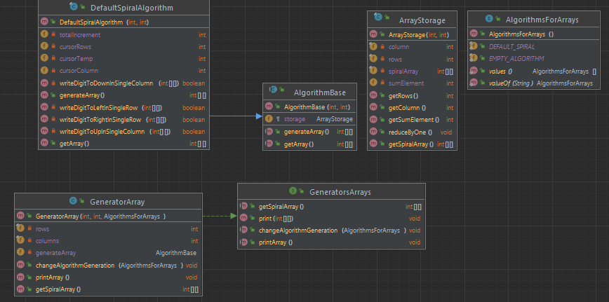
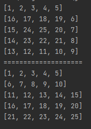

Задача: Закрутить 2d массив в спираль

  
Клиентский код:

```
Generator generator =new Generator(5, 5, AlgorithmsList.SPIRAL);
generator.printArray();
System.out.println("=".repeat(20));
generator.changeAlgorithmGeneration(AlgorithmsList.CLASSIC_FILL);
generator.printArray();
```

Способ решения:  
Чередование четырех функций: вправо - вниз - назад - вверх

Работает с любым 2d массивом. Будь то квадрат или прямоугольник.

**Особенности:**

- Основной класс Generator содержит фабричные метод.   
  Дает возможность применять различные способы генерации массивов. Унифицированное решение.
- А дальше идет активация алгоритма по принципу паттерна "команда"

Тесты:  


