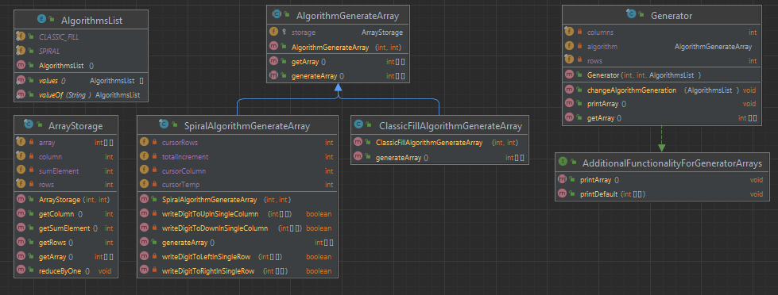

Задача: Закрутить 2d массив в спираль

Способ решения:  
Чередование четырех функций: вправо - вниз - назад - вверх

Работает с любым 2d массивом. Будь то квадрат или прямоугольник.

**Особенности:**
- расширяемость алгоритмов генерации массива за счет паттерна Bridge
- Можно применять различные способы генерации массивов. Унифицированное решение.

Тесты:

